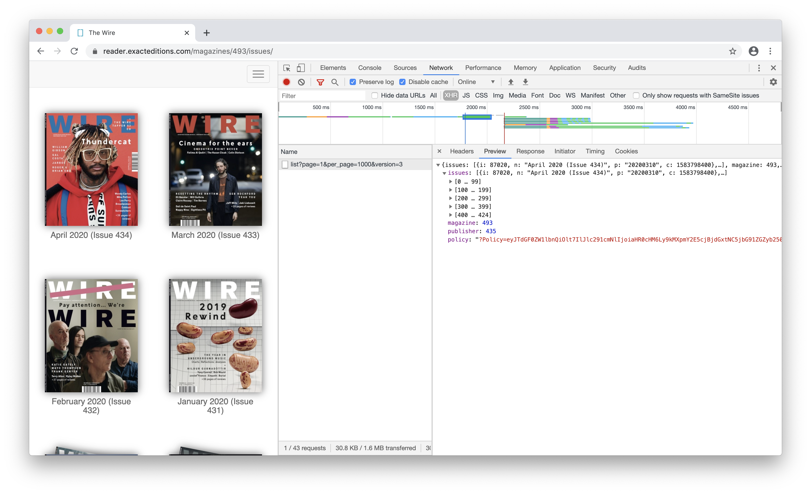
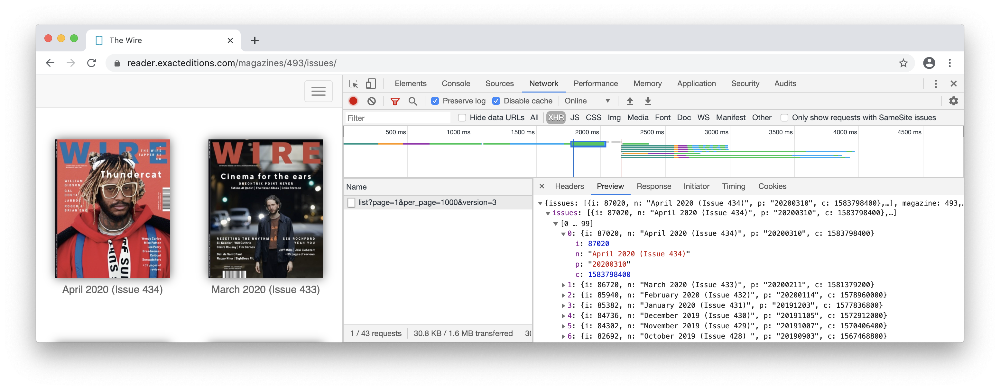
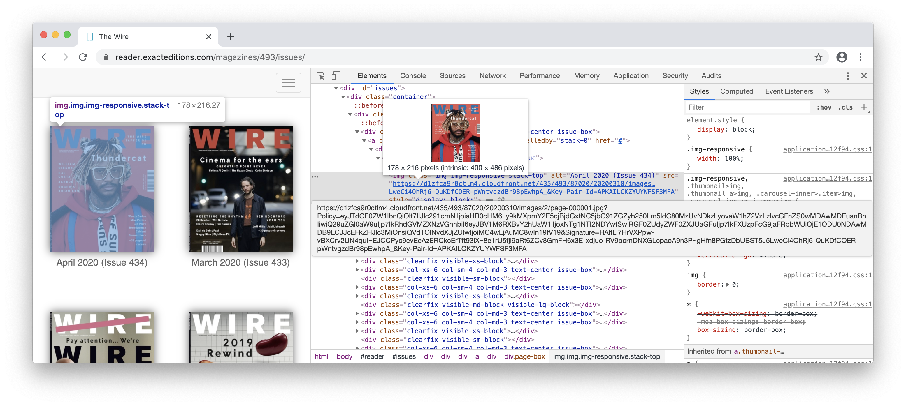
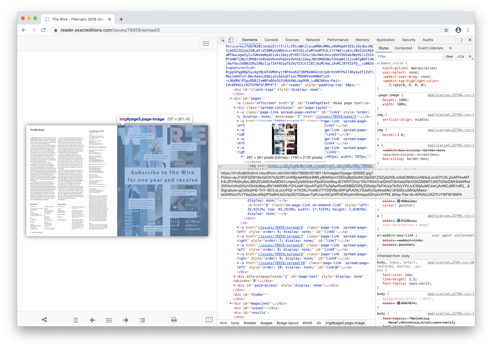
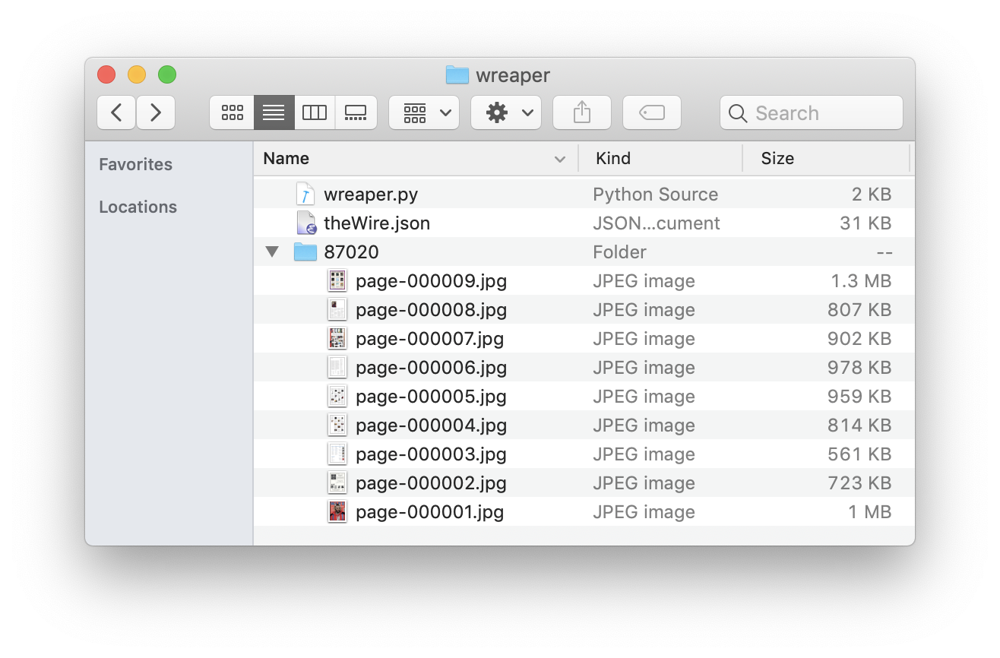

# Reap the Wire

(a crawler setup record)

thewiremagazine said they would open the Wire's complete archive of back issues to everyone until 28 Mar 2020, for free. I saw this on the night of 27 Mar and as a music enthusiast, I was like, I should do something.

 

What am I going to do? A crawler? It could not be better than getting all the issues in my local. 

## Planning

Here're several screenshots of the site, with API information:




and what a specific issue looked like in HTML:



and a page:



Page urls followed a pattern. I realized it maybe possible for me to directly get to any page I want with the following keys provided in the API:
- i - issue id
- p - publish time of the issue
- policy - guess for AAA?

then based on these information, I could make the Wire saved in my local in this way:
```
$ tree
.
|---issue 0
|   |---page 0
|   |---page 1
|   |---...
|   |---page n
|---issue 1
|---...
|---issue n
```

## What I did

- create a dir called `wreaper` - the Wire Reaper
- save [the issue summary](https://reader.exacteditions.com/magazines/493/issues/list?page=1&per_page=1000&version=3) as a json file called `theWire.json`
- create a py file called `wreaper.py`
- trigger the py file

`wreaper.py` details:
```
import json
import os

with open('theWire.json') as f:
    db = json.load(f)

policy = db['policy']
issues = db['issues']
wreaper_path = '/Users/yuqing.ji/wreaper'

for issue in issues: 
    issue_i = issue['i']
    issue_p = issue['p']
    os.mkdir(os.path.join(wreaper_path, '%s' % issue_i))
    os.chdir(os.path.join(wreaper_path, '%s' % issue_i))
    n = 1
    while n < 120:   # each issue with around 100 pages
        n_str = '%s'.rjust(7, '0') % n
        url = 'curl "https://d1zfca9r0ctlm4.cloudfront.net/435/493/%s/%s/images/3/page-%s.jpg%s" -o page-%s.jpg; sleep 5;' % (issue_i, issue_p, n_str, policy, n_str)
        os.system(url)
        n += 1
```


## The end

Do not be fooled by my screenshot above ;) 

Those are the only pages I got in the end - I started the script, saw 'everything works well', then went to sleep. When I checked it out the next day, I found e.g. issue id=87020 with the pages only for preview! 
The most likely problem I guess was the IP ban since I needed proxy to open any issue page in my web browser, which means I should make my script over the Wall. Will try if there's a next time.

<div style="border-top:1px solid #e1e4e8;padding-top:16px"></div>
<div>© 2018-2020 by YUQING JI</div>
<div style="padding-top:0.3em"><a href="https://vjyq.github.io/vjyq.github.io/en/">Blog</a> | <a href="mailto:yuqing.ji@outlook.com">Email</a> | <a href="https://github.com/vjyq">Github</a></div>