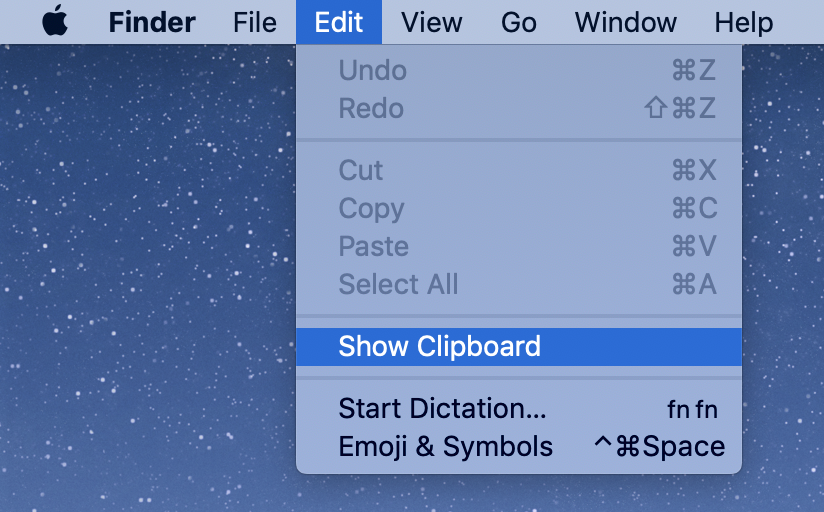
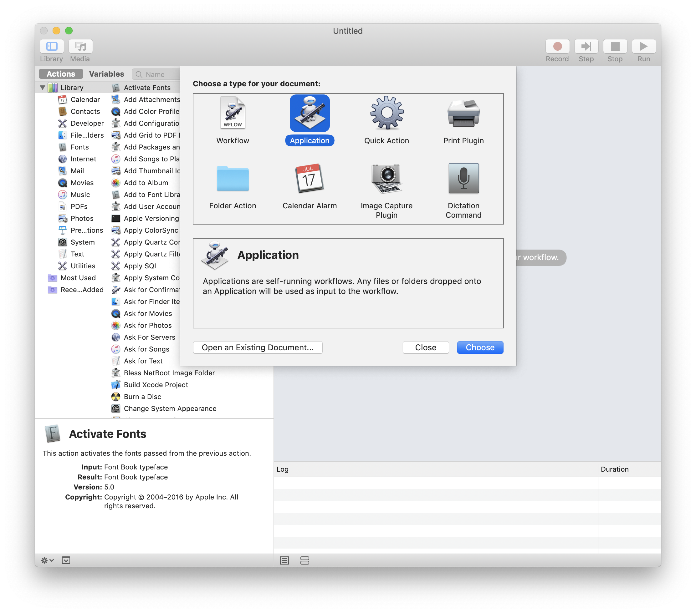
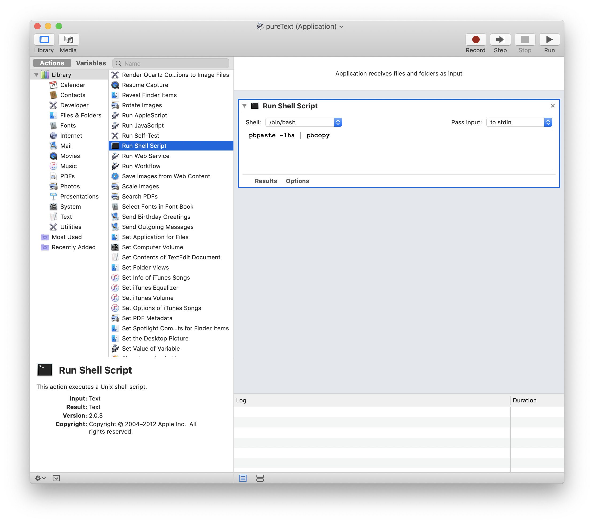
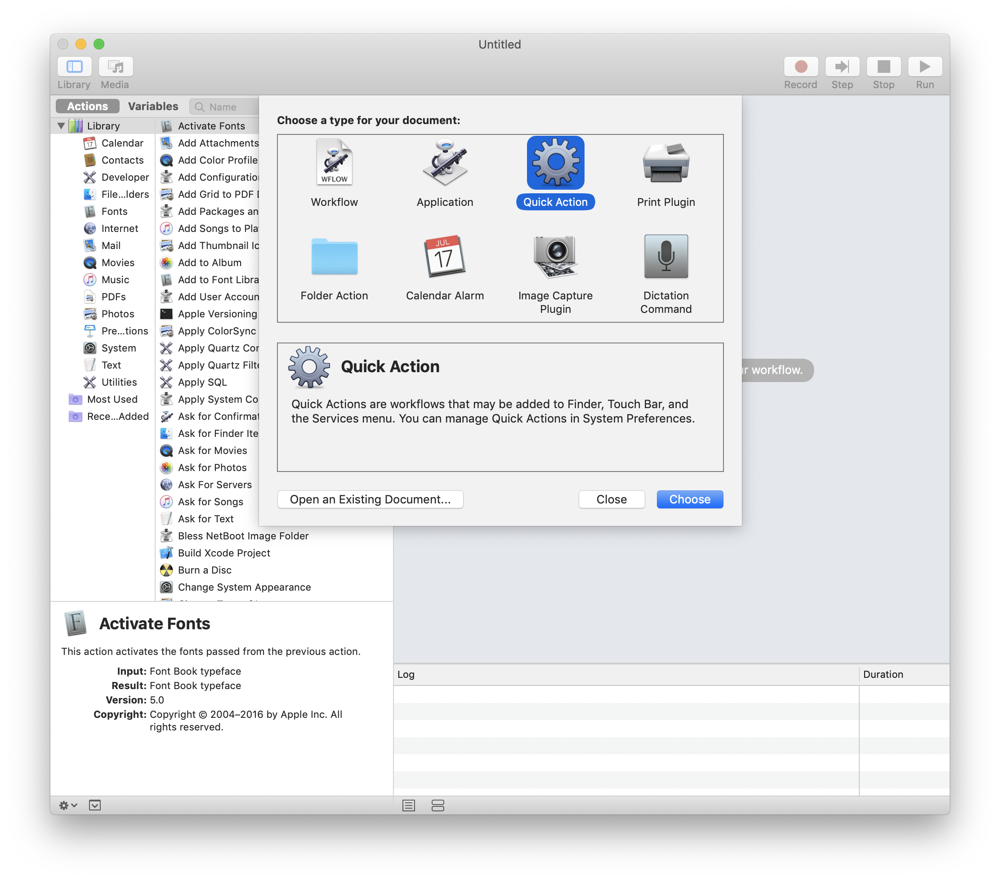
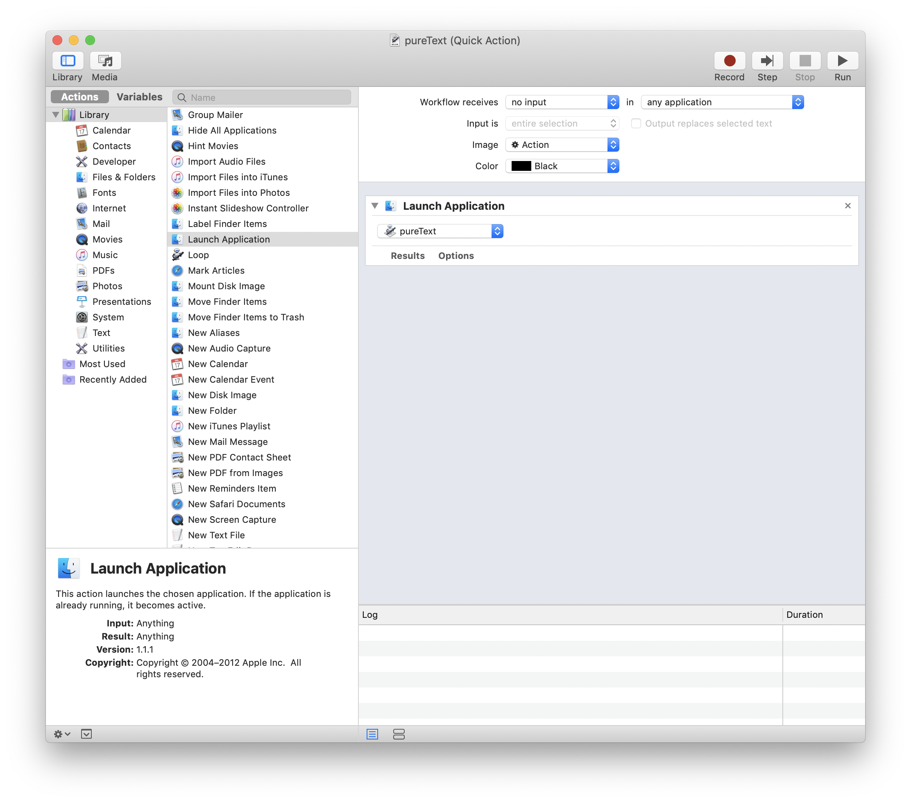
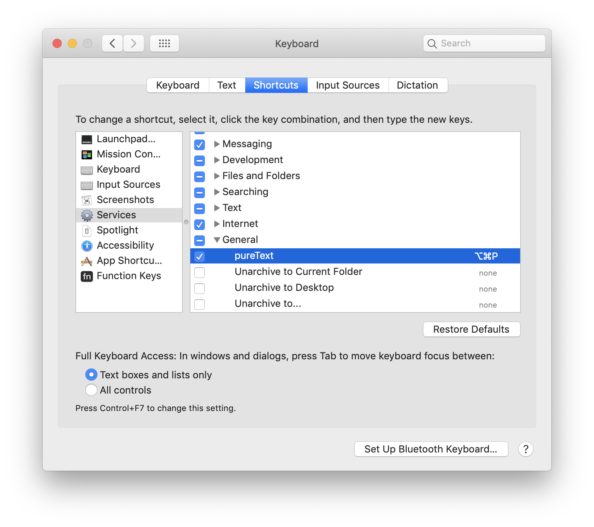

# Copypaste pure text in macOS

I take notes when surfing online. Format is a thing that gives me a headache - the format of the copied text. 
People use format to make things look better. I do the same. For me, pure text is the best. 
As you can see from the GIF above, copy and paste from a web page with Command-C Command-V to the default Notes, you would get formatted content like an underlined word with a hyperlink pointing to another resource.
Of course you could get rid of the format by an edit or copypaste that to for example an IDE first, but imagine you may need to repeat this for 10 or even more times a day, is there any better solution?

To handle this, I tried an app called 'Get Plain Text'. It's good but I had a concern during usage: 
- How does it work? Does it sync my copies to remote? Not doubt just question. 

I did a search for these questions then found it not hard to remove the copy format: 
- after the Command-C, open your terminal then `$ pbpaste -lha | pbcopy` - pure text would be returned. See changes in Finder -> Edit -> Show Clipboard.

But it still doesn't seem efficient to get the copied - you need to 1) open terminal 2) type command 3) copy the text. 
Below is my resolution. In brief, I made them in a keyboard shortcut. 3 steps to setup: 

1. Package the bash command into an application

2. Automate the exec action

3. Set the shortcut
- Here's Apple's keyboard shortcuts: https://support.apple.com/en-us/HT201236. Duplicates shall be avoided. 

That's it. I could get pure text via a Command-Option-P between Command-C Command-V like the GIF at the beginning.

© 2018-2020 by YUQING JI

<a href="https://vjyq.github.io/vjyq.github.io/en/">Blog</a> | <a href="mailto:yuqing.ji@outlook.com">Email</a> | <a href="https://github.com/vjyq">Github</a>
