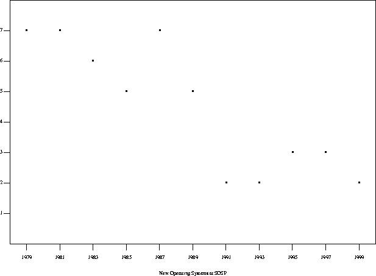

# 系统软件研究是不重要的

**原文：[Systems Software Research is Irrelevant](http://doc.cat-v.org/bell_labs/utah2000/utah2000.html)**

**作者：[Rob Pike](http://herpolhode.com/rob/)，写于 2000 年 8 月 5 日，EST 时间 23:59**

**翻译：[Yuqing Ji](https://vjyq.github.io)，译于 2020 年 4 月 18 日**

 

## 争议

我想借这篇文章谈下自己近段时间对于系统研究的一些悲观看法。积极的方面已经有太多相关讨论，我就不再赘述。我的话可能听起来比较消极，但我认为实际情况就是这么糟糕，需要改变。

## 定义

系统：操作系统、网络、语言；串起程序的一切。

软件：字面意思。

研究：主要指在高校和一些工业实验室里搞的学术研究。

是：当下，不是指十年前，我也希望不适用于十年后。

不重要的：对行业没有影响。

## 观点

系统软件研究已经被计算行业边缘化。

你上一次看一个非商业性质的相关技术展示是什么时候？

眼下"计算"几乎成了"创新"的代名词，而讽刺的是，在高校和工业界，软硬件研究正在变得狭隘。

造成当前局面的原因有很多，有些和领域本身有关，有些不是，那些和领域无关的可以避免。

局面可能有办法扭转，但这需要整个行业共同努力。

## 萧条的领域

SOSP<a href="#1">[1]</a> 上出现的新操作系统

 

如果你问，"有谁需要新的操作系统？"回答可能是没有。这也刚好印证了我的观点。

你可能会说，"不是还有大量论文在讨论文件系统、性能、安全、网页缓存这些方面吗？"是的，但行业外有人关注这些吗？

## 系统研究对大时代的贡献

<table align="center">
  <caption>一个高端工作站</caption>
  <tbody>
    <tr>
      <th align="center">1990</th>
      <th align="center">2000</th>
    </tr>
    <tr><td align="center" colspan="2"><i>硬件</i></td></tr>
    <tr>
      <td>33MHz MIPS R3000 32MB 内存 支持 10Mbps 以太网</td>
      <td>600MHz Alpha 或 Pentium III 512MB 内存 支持 100Mbps 以太网</td>
    </tr>
    <tr><td align="center" colspan="2"><i>软件</i></td></tr>
    <tr>
      <td valign="top">Unix X Emacs TCP/IP </td>
      <td>Unix X-Window Emacs TCP/IP Netscape</td>
    </tr>
    <tr><td align="center" colspan="2"><i>语言</i></td></tr>
    <tr>
      <td valign="top">C C++  </td>
      <td>C C++ Java Perl（一点点）</td>
    </tr>
  </tbody>
</table>

1990 到 2000 这十年，硬件极速迭代，软件停滞不前。

## 创新在哪里

基本都体现在 Microsoft 的产品上。你可以试着对比下 1990 和 2000 Microsoft 的软件。

如果你说，这是复制不是创新。我会告诉你，你的态度代表了业界在面对一个有趣但有技术瑕疵的系统软件时的一种反应。1990 和 2000 的 Microsoft 区别之大，就好比 Windows 之于 Macintosh，Java 之于 C++。

如果系统研究重要，我们就会像七、八十年代那样不断看到新的操作系统和语言涌入工业界。

可我们今天能看到什么？一个欣欣向荣与此同时无视研究的软件行业，一个写论文比写软件勤快的研究领域。

## Linux

革命？创新？并没有，Linux 只是再造的轮子。

之所以说再造，你可以从程序开发角度，比较下 Linux 和 Microsoft Visual Studio 或 IBM Java/Web toolkits。

Linux 的成功为我的观点提供了有力的支撑：一个几十年前操作系统的再造能有这样的影响，反应了这几十年来系统软件研究的断档。

此外，Linux 的聪明之处在于研发模型而不是软件本身，算不上学术领域特别是软件工程领域的一个成功案例。

## 当下系统研究在研究什么

研究网页缓存、网页服务器、文件系统、网络延迟，诸如此类，涉及性能、外设、应用，但不包括内核层或是用户层的应用。

大多数研究只是是一堆测量、解释和科学方法的乱用。

研究多流于表面，只观测、不创造。当下有些论文在比较 Linux 和 Windows 的中断延时，这样的讨论可能有趣甚至重要，但这不是研究。

为了让研究显得科学，做了大量不必要的测量，过度强调细节和图表展示。

让计算机看起来与众不同的本应该是一种新语言或者操作系统，但在今天，创新却等价于一个炫酷的网站、更高的 CPU 时钟频率，或是一些可爱的小玩意儿。

系统研究的艺术性已经不复存在。

系统研究不只是科学，它也是工程，是设计，是门艺术。

## 发生了什么？

发生了很多事。

### PC

硬件变得便宜又好。如果它最终不在 PC 上跑也无所谓，PC 怎么着都是 PC。

即便追溯到 1980 年代，系统研究工作也大都只是围绕一些新架构展开，比如 RISC、iAPX/432、Lisp Machines。也许再也看不到有意思的问题和有意思的解法了。

也有不少研究在架构兼容上下功夫，期待是，让操作系统在不同架构上都能跑起来。但是，如果硬件变一样了，这根本不是个问题。

Plan 9 可能是这世上最具兼容性的操作系统，我们即将发布 PC 端新版。这次也会发布兼容其他架构的源，意在填坑，希望没人用到它们。

这里只谈了 PC 的硬件部分，软件部分可以照猫画虎地理解。

### Microsoft

这是个老生常谈的话题。

Microsoft 只是个幌子，不是症结所在。

之后我会详细讲。

### Web

1990 年代初 Web 诞生，它对计算机科学届的影响不亚于对商界的冲击。

在这之后涌现出无数但都不那么有效的讨论，商界掌握了主要话语权——Web 始于物理学界，兴于工业界。

IBM 的 Bruce Lindsay 说：HDLC 约等于 HTTP/HTML；就好比 Visicalc 和 PC，3270s<a href="#2">[2]</a> 已经被 Web 浏览器取代。

尽管学界出了大量关于缓存、代理、服务器架构等等这些方面的论文，但在 Web 发展上发挥的作用微乎其微。

### 协议

一个能用的计算机系统必须支持下面这么多不断变化的协议：TCP/IP、HTTP、HTML、XML、CORBA、Unicode、POSIX、NFS、SMB、MIME、POP、IMAP、X、……

支持它们需要做大量工作，但你如果不支持，你会被边缘化。

我估算了一下，Plan 9 90% 到 95% 的工作是直接或间接支持这些协议。

而在处理指令集架构、总线等方面时也是同样的情况。

有那么多东西要支持，留给创新的空间几乎没有。

更惨的是，有些公司自己有一套协议，比如 Microsoft 和 Cisco，他们为了防止竞争故意把协议搞得很难兼容。学界连带"中枪"。

### 信仰

今天的博士毕业生们在用 Unix、X、Emacs 和 Tex。这很有可能是他们在做技术方面工作时所能接触到的全部计算世界。

而在20年前，一个学生需要面对各种操作系统。这些操作系统有好有坏，层次不齐。

眼下我们实验室的新人进组时不是自带装备就是期待组里已经有他们想要的装备。这虽然合理，但加入新实验室不刚好是个学新东西的契机？

限制体验会限制想象力。

类似的情况在语言方面稍微好一些——比如，学生可以在很多课程里接触到函数式语言。但不是说人们没有语言信仰，比如 C++ 和 Java。

科学界尊崇那些发现问题的人，但在计算机科学界……

### 成本的变化

既要考虑那么多外在限制，还要兼容那么多既有成果，这让很多有意思的事情做起来更花功夫。比如，写一个当下能用的操作系统需要花费大量人年，这对于很多高校来说负担不起。

时间周期拉长——从设计到落地可能要五年，对大多数学生来说，这超出了他们的学制。

这就意味着，工业界往往可以做比如操作系统、架构这类决定性的大项目，而小课题组必须专注在小东西上。

这三种趋势导致（研究）：
1. 不构建，只测量——浮于表面，没有创新。
2. 只求深度，不求广度——锱铢化，非系统性。
3. 不断折腾已有的东西。

我认为这是形成 SOSP 曲线的主要原因。

### Unix

在今天，新的操作系统大都只是 Unix 的变型。人们想做些新架构时，第一件事就是搭一层 Unix。

既然操作系统最终都大同小异，研究操作系统怎么会有意义？

1970 年代末 1980 年代初有一种说法：鉴于没人会去尝试除了 Unix 之外的其他操作系统，Unix 相当于灭了操作系统这个研究领域。那个时候听到这话我还不相信，时至今日，我得承认这话可能是对的（尽管还有 Microsoft）。

Unix 的灵活好用让它一家独大，这意味着，架构不重要，不然不会只剩这一个。

Linux 是新热点，但它也基于 Unix。

### Linux，学术版 Microsoft Windows

"圣三位"<a href="#3">[3]</a>：Linux, gcc 和 Netscape。

当然，这算是另一种信仰。

它们被捧不仅仅是因为它们是什么，也因为它们不是 Microsoft。

但从技术层面来说，它们没有那么火。Microsoft 非常努力，我认为，Microsoft 有很多产品在技术上已经超过了"圣三位"，并且他们还在持续优化。

而 Linux 可能会重蹈 Macintosh 覆辙：固步自封，最终走向淘汰。

系统研究领域也没有做什么来改进"圣三位"。

### 创业公司

在想法落地、融资、招贤纳士、吸纳学生这些方面，和学界竞争的主要是创业公司。其他竞争对手有 Microsoft、大公司、自由职业者、IETF。

这让政府基金、企业扶持的研究以快速实现投资回报为导向。

而这一点打乱了研究的优先级：
- 要求研究能赚大钱，比如一年之内 IPO。
- 没法进行长期研究，继而导致架构和成本的问题。
- 资金来源（政府、企业）面临同样的压力，形成恶性循环。

价值的衡量标准错了。

Stanford 因为企业主投资的关系现在鼓励学生去创业公司。新校长算得上一个成功的企业家了。

### 奶奶

奶奶上线了。

工业界开始为普通人设计系统和服务。设计重心在于应用和设备，而不是系统研究主要关注的基建和架构。

原因在于各种产品加大了营销力度，结果人们发现存在大量设备兼容问题。而你只能靠硬件而不是软件赚钱，所以在这种情况下，比起落地一个新想法，还是搞一个噱头比较实际。

曾经在计算届被推崇的可编程性，已经不复存在。

还是那句话，系统研究没落了。

## 需要做什么

创新过程中，大公司不愿扔掉历史包袱，创业公司过分重视短期回报、只好从研究中汲取能量。但淘金潮终将褪去，需要着手准备下一步。

“为什么用 Plan 9？”

重新思考和构建系统。注重广度而不是深度——这是系统研究的精髓。

研究不同系统是怎么表现以及工作的，而不仅仅作比较。聚焦接口和架构、而不只是怎么实现。

要有勇气实验，做些不一样的事情。试着做个炫酷的演示。

投资人投钱的时候可以更勇敢些，特别在对待长期项目时。相应地，高校应该尽可能让学生参与到长期项目中去。

成功不只是论文和钱，也包括想法。让工业界想用你的成果。

## 可以做什么

还有很多有用、有趣的事情可以去做，这里我简单举几个例子。如果哪天这个领域不行了，并不是因为没有事情可以做。

（比如）

时至今日人们只试过一种 GUI，与之相关的优秀设计都出自 1970 年代（从某些方面来看，它在变差，比如今天的屏幕堆满了不明所以的小图、Linux 的界面甚至没有 Windows 的好用）。GUI 肯定还有其他可能。

关于组件架构的讨论有很多，但可见产出只有 Unix pipes。其实应该可以构建出组件间相互影响的分布式应用。

未来属于分布式计算，但语言社区几乎没怎么聊到这方面。

Web 已经在主导系统呈现和使用信息了——任何功能都会涉及交互、用户必须学着使用。可我们应该先拥抱用户数据。

系统管理依旧会是个深且难的问题。尽管枯燥，但改进空间甚至商机无限。

## 结论

世界已经决定了计算机何去何从，过去，系统软件研究群体在某种程度上能影响决策，即便微乎其微，而现在，已经没有话语权。

这也是为什么我认为，一个优秀的系统研究项目拿不到经费，即便拿到经费，也做不了有意义的研究。过去还有胜算，现在根本不可能。

整个社群，包括高校、学生、业界、拨款机构，必须调整各自的优先级。

必须接受并探索那些非主流的想法。

必须把学术研究从资本化中抽离出来。

 

<a name="1">[1]</a> 译者注：<a href="http://sosp.org">http://sosp.org</a>

<a name="2">[2]</a> 译者注：<a href="https://www.ibm.com/support/knowledgecenter/en/SSGMGV_3.1.0/com.ibm.cics.ts31.doc/dfhp3/dfhp3bg.htm">https://www.ibm.com/support/knowledgecenter/en/SSGMGV_3.1.0/com.ibm.cics.ts31.doc/dfhp3/dfhp3bg.htm</a>

<a name="3">[3]</a> 译者注：<a href="https://en.wikipedia.org/wiki/Trinity">https://en.wikipedia.org/wiki/Trinity</a>

 

如果您觉得翻译有误，欢迎<a href="mailto:yuqing.ji@outlook.com">邮件</a>联系指正。

 

© 2018-2020 YUQING JI 版权所有

<a href="https://vjyq.github.io/zh/">博客</a> | <a href="mailto:yuqing.ji@outlook.com">邮箱</a> | <a href="https://github.com/vjyq">Github</a>
